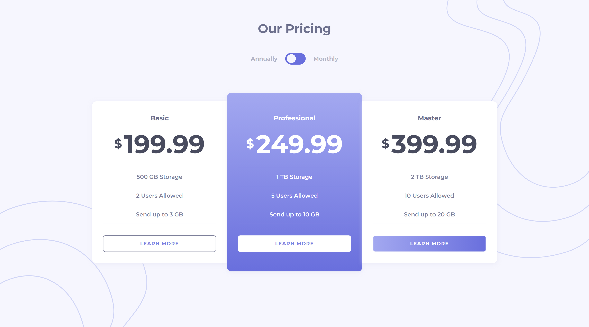

# Pricing component with toggle

Users should be able to:

- View the optimal layout for the component depending on their device's screen size
- Control the toggle with both their mouse/trackpad and their keyboard

### Screenshot

**Snapshot of project at desktop width 1440px > Hover on button in Basic**

### Built with

- Semantic HTML5 markup
- CSS custom properties
- Flexbox
- Mobile-first workflow

## Author
Meenu Soni 👨‍💻

